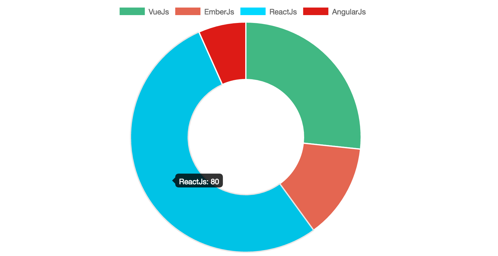
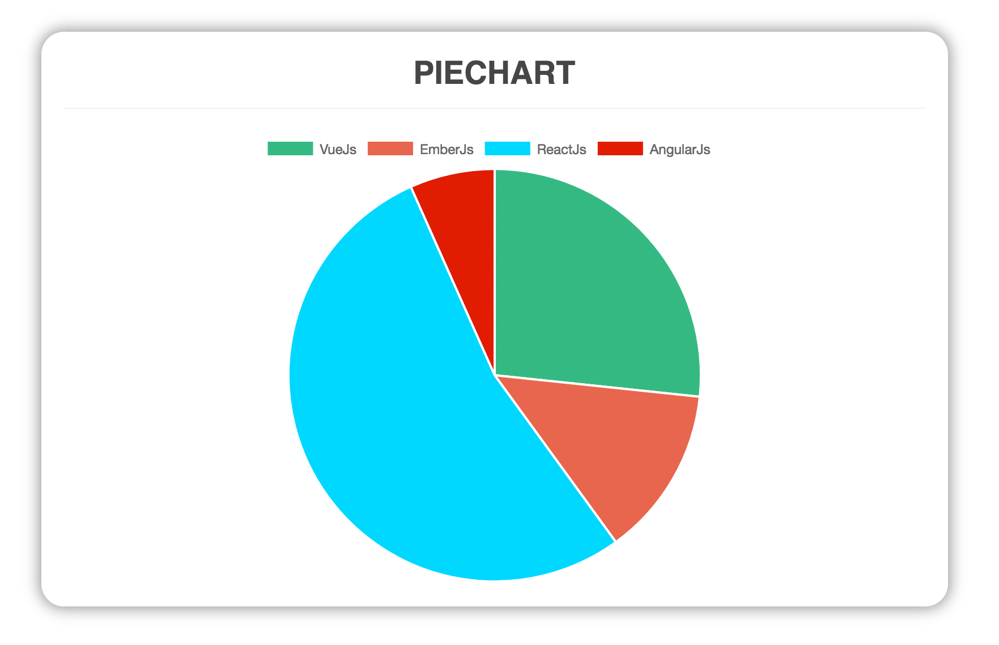
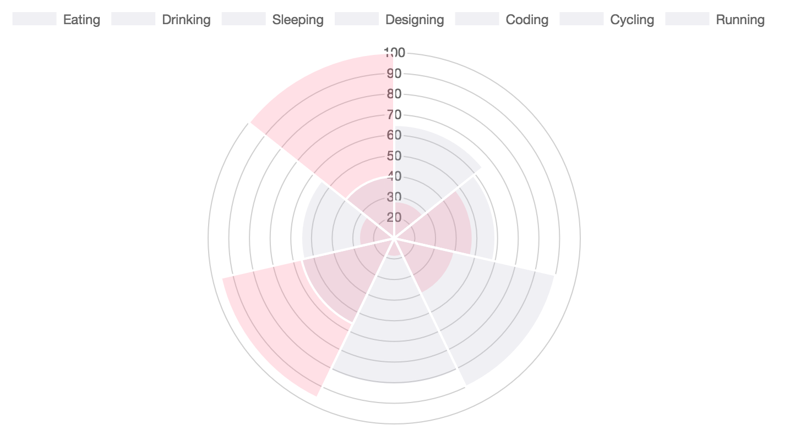

<div align="center">
  
</div>

[](https://badge.fury.io/js/vue-chartjs)
[](https://codecov.io/gh/apertureless/vue-chartjs)
[](https://travis-ci.org/apertureless/vue-chartjs)
[](http://packagequality.com/#?package=vue-chartjs)
[](https://www.npmjs.com/package/vue-chartjs)
[](https://gitter.im/vue-chartjs/Lobby)
[](https://github.com/apertureless/vue-chartjs/blob/master/LICENSE.txt)
[](https://cdnjs.com/libraries/vue-chartjs)

# vue-chartjs

**vue-chartjs** is a wrapper for [Chart.js](https://github.com/chartjs/Chart.js) in vue. You can easily create reuseable chart components.

## Demo & Docs

- 📺 [Demo](http://demo.vue-chartjs.org/)
- 📖 [Docs](http://www.vue-chartjs.org/)

### Compatibility

- v1 later `@legacy`
  - Vue.js 1.x
- v2 later
  - Vue.js 2.x

After the final release of vue.js 2, you also get the v2 by default if you install vue-chartjs over npm.
No need for the @next tag anymore. If you want the v1 you need to define the version or use the legacy tag.
If you're looking for v1 check this [branch](https://github.com/apertureless/vue-chartjs/tree/release/1.x)

## Install

Simply run `yarn add vue-chartjs chart.js`

Or if you want to use it directly in the browser add

```html
<script src="https://unpkg.com/vue-chartjs/dist/vue-chartjs.full.min.js"></script>
```
to your scripts. See [Codepen](https://codepen.io/apertureless/pen/vxWbqB?editors=1010)

## Explanation of Different Builds
There are three different entry points. It depends on which build setup do you have. The dependencies are bundled or required as a peerDependency.

- Browser
- Browserify / Webpack 1
- Webpack 2


| Build | Chart.js | Vue.js |
|---|---|---|
| vue-chartjs.full.js | Bundled | Bundled |
| vue-chartjs.full.min.js |  Bundled | Bundled  |
| vue-chartjs.js | peerDependency | peerDependency  |
| vue-chartjs.min.js | peerDependency  | peerDependency  |
| es/index* |  peerDependency | peerDependency  |

### Browser
You can use `vue-chartjs` directly in the browser without any build setup. Like in this [codepen](https://codepen.io/apertureless/pen/vxWbqB?editors=1010). For this case, please use the `vue-chartjs.full.min.js` which is the minified version. It has Vue.js and Chart.js bundled into it. And bundled to a UMD Module. So you only need that one file.


### Browserify / Webpack 1

If you're using Gulp, Browserify or Webpack 1 the entry is `vue-chartjs.js` which is __transpiled__ and __bundled__ UMD Module.

However Vue.js and Chart.js are `peerDependencies` so you have to install them separately. In most projects you will have `Vue.js` already installed anyways. This way, you can have different versions of Vue.js and Chart.js then in this package.

### Webpack 2
If you're using Webpack 2 it will automatically use the `jsnext:main` / `module` entry point. Which is `es/index.js`
It is a __transpiled__ es version of the source. And is not __bundled__ to a module. This way you three shaking will work.  Like in the bundled version, `Vue.js` and `Chart.js` are `peerDependencies` and need to be installed.


## How to use

You need to import the base chart class and extend it. This gives much more flexibility when working with different data. You can pass the data over props or vue-resource.

You can import the whole package or each module individual.

```javascript
import VueCharts from 'vue-chartjs'
import { Bar, Line } from 'vue-chartjs'
```

Just create your own component.

```javascript
// CommitChart.js
import { Bar } from 'vue-chartjs'

export default Bar.extend({
  mounted () {
    // Overwriting base render method with actual data.
    this.renderChart({
      labels: ['January', 'February', 'March', 'April', 'May', 'June', 'July', 'August', 'September', 'October', 'November', 'December'],
      datasets: [
        {
          label: 'GitHub Commits',
          backgroundColor: '#f87979',
          data: [40, 20, 12, 39, 10, 40, 39, 80, 40, 20, 12, 11]
        }
      ]
    })
  }
})
```

Then simply import and use your own extended component and use it like a normal vue component

```javascript
import CommitChart from 'path/to/component/CommitChart'
```

## Another Example with options

You can overwrite the default chart options. Just pass the options object as a second paramenter to the render method

```javascript
// MonthlyIncome.js
import { Line } from 'vue-chartjs'

export default Line.extend({
  props: ['data', 'options'],
  mounted () {
    this.renderChart(this.data, this.options)
  }
})
```

Use it in your vue app

```javascript
import MonthlyIncome from 'path/to/component/MonthlyIncome'

<template>
  <monthly-income :data={....} />
</template>

<script>
export default {
  components: { MonthlyIncome },
  ....
}
</script>
```

## Reactivity

Chart.js does not update or re-render the chart if new data is passed.
However you can simply implement this on your own or use one of the two mixins which are included.

- `reactiveProp`
- `reactiveData`

Both are included in the `mixins` module.

The mixins automatically create `chartData` as a prop or data. And add a watcher. If data has changed, the chart will update.
However keep in mind the limitations of vue and javascript for mutations on arrays and objects. More info [here](http://vue-chartjs.org/#/home?id=reactive-data)

```javascript
// MonthlyIncome.js
import { Line, mixins } from 'vue-chartjs'

export default Line.extend({
  mixins: [mixins.reactiveProp],
  props: ['chartData', 'options'],
  mounted () {
    this.renderChart(this.chartData, this.options)
  }
})

```

### Mixins module
The `mixins` module is included in the `VueCharts` module and as a seperate module.
Some ways to import them:

```javascript
// Load complete module with all charts
import VueCharts from 'vue-chartjs'

export default VueCharts.Line.extend({
  mixins: [VueCharts.mixins.reactiveProp],
  props: ['chartData', 'options'],
  mounted () {
    this.renderChart(this.chartData, this.options)
  }
})
```

```javascript
// Load speperate modules
import { Line, mixins } from 'vue-chartjs'

export default Line.extend({
  mixins: [mixins.reactiveProp],
  props: ['chartData', 'options'],
  mounted () {
    this.renderChart(this.chartData, this.options)
  }
})
```

```javascript
// Load speperate modules with destructure assign
import { Line, mixins } from 'vue-chartjs'
const { reactiveProp } = mixins

export default Line.extend({
  mixins: [reactiveProp],
  props: ['chartData', 'options'],
  mounted () {
    this.renderChart(this.chartData, this.options)
  }
})
```

## Available Charts

### Bar Chart


### Line Chart


### Doughnut



### Pie



### Radar


### Polar Area



### Bubble


### Scatter


## Build Setup

``` bash
# install dependencies
npm install

# serve with hot reload at localhost:8080
npm run dev

# build for production with minification
npm run build

# run unit tests
npm run unit

# run e2e tests
npm run e2e

# run all tests
npm test
```

For a detailed explanation on how things work, check out the [guide](http://vuejs-templates.github.io/webpack/) and [docs for vue-loader](http://vuejs.github.io/vue-loader).

## Contributing

1. Fork it ( https://github.com/apertureless/vue-chartjs/fork )
2. Create your feature branch (`git checkout -b my-new-feature`)
3. Commit your changes (`git commit -am 'Add some feature'`)
4. Push to the branch (`git push origin my-new-feature`)
5. Create a new Pull Request

## License

This software is distributed under [MIT license](LICENSE.txt).
