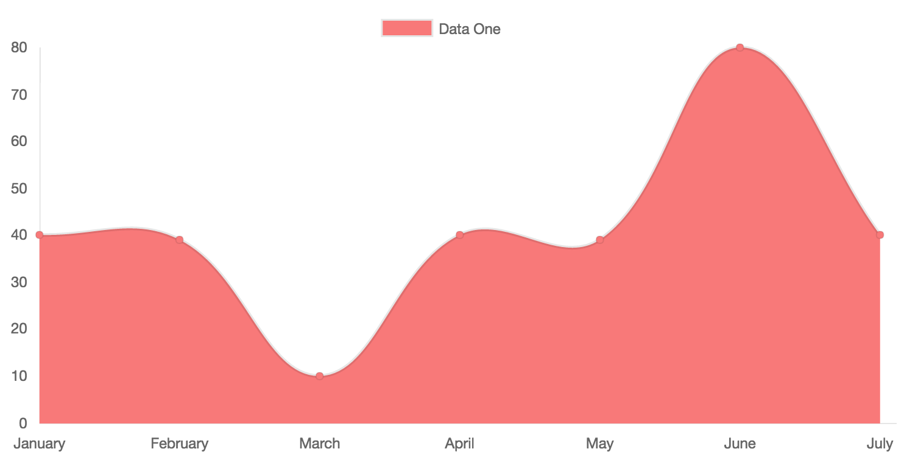
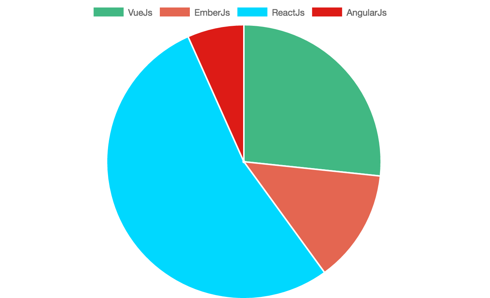
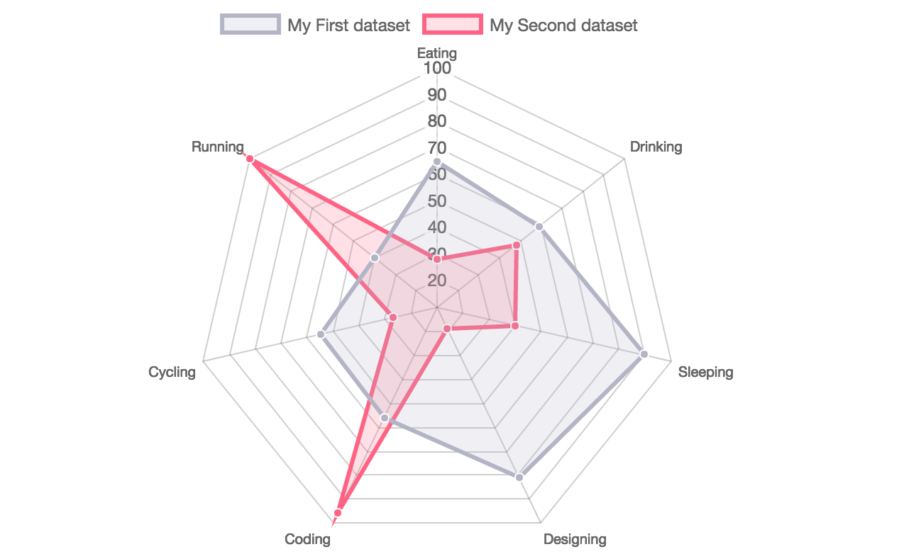

# Vue-ChartJs

> VueJS wrapper for ChartJs

## How to use

You need to import the base chart class and extend it. This gives much more flexibility when working with different data. You can pass the data over props or vue-resource.

Just create your own component.

```javascript
// CommitChart.js
import BarChart from '../BaseCharts/Bar'

export default BarChart.extend({
  ready () {
    // Overwriting base render method with actual data.
    this.render({
      labels: ['January', 'February', 'March', 'April', 'May', 'June', 'July', 'August', 'September', 'October', 'November', 'December'],
      datasets: [
        {
          label: 'GitHub Commits',
          backgroundColor: '#f87979',
          data: [40, 20, 12, 39, 10, 40, 39, 80, 40, 20, 12, 11]
        }
      ]
    })
  }
})
```

Then simply import and use your own extended component and use it like a normal vue component

```javascript
import CommitChart from 'path/to/component/CommitChart'
```

## Another Example with options

You can overwrite the default chart options. Just pass the options object as a second paramenter to the render method

```javascript
// MonthlyIncome.js
import LineChart from '../BaseCharts/Line'

export default LineChart.extend({
  props: [data, options],
  ready () {
    this.render(this.data, this.options)
  }
})
```

Use it in your vue app

```javascript
import MonthlyIncome from 'path/to/component/MonthlyIncome'

<template>
  <monthly-income :data={....} />
</template>

<script>
export default {
  components: { MonthlyIncome },
  ....
}
</script>
```

## Available Charts

### Bar Chart


### Line Chart



### Doughnut


### Pie



### Radar



### Polar Area


## Todo

- [x] ~~Implement Bar Chart~~
- [x] ~~Implement Line Chart~~
- [x] ~~Implement Radar Chart~~
- [x] ~~Implement Polar Area Chart~~
- [x] ~~Implement Pie Chart~~
- [x] ~~Implement Doughnut Chart~~
- [ ] Make npm module
- [ ] Add tests


## Build Setup

``` bash
# install dependencies
npm install

# serve with hot reload at localhost:8080
npm run dev

# build for production with minification
npm run build

# run unit tests
npm run unit

# run e2e tests
npm run e2e

# run all tests
npm test
```

For detailed explanation on how things work, checkout the [guide](http://vuejs-templates.github.io/webpack/) and [docs for vue-loader](http://vuejs.github.io/vue-loader).
