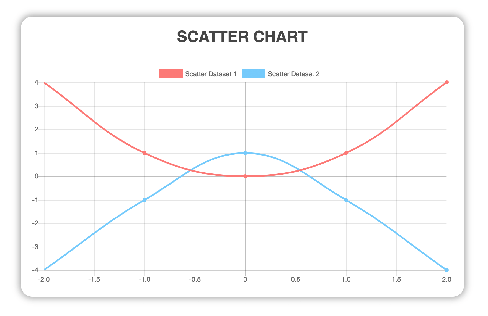

# vue-chartjs
**vue-chartjs** is a wrapper for [Chart.js](https://github.com/chartjs/Chart.js) in vue. You can easily create reuseable chart components.

## Introduction
`vue-chartjs` let you use chart.js without much hassle inside vue. It's perfect for people who need simple charts up and running as fast as possible.

It abstracts the basic logic but exposes the chart.js object to give you the most possible flexibility.

## Installation
If you are working with Vue.js 2+ simple run:

`yarn add vue-chartjs chart.js`

If you are using vue 1.x please use the `legacy` tag. However the vue 1 version is not maintained anymore.

`yarn add vue-chartjs@legacy`

## Quick Start

You need to import the base chart and extend it. This gives much more flexibility when working with different data.
You can encapsulate your components and use props to pass data or you can directly imput them inside the component. However this way, your component is not reuseable.

You can import the whole package or each module individual.

```javascript
// CommitChart.js
import { Bar } from 'vue-chartjs'

export default Bar.extend({
  mounted () {
    // Overwriting base render method with actual data.
    this.renderChart(data, options)
  }
})
```

You can pass the `renderChart()` method, two arguments:

- Data object
- Options object

### Data object

The data object looks like this:

```javascript
{
  labels: ['January', 'February'],
  datasets: [
    {
      label: 'GitHub Commits',
      backgroundColor: '#f87979',
      data: [40, 20]
    }
  ]
}
```

For more information take a look at the [Chart.js](http://www.chartjs.org/docs/#chart-configuration-chart-data) docs.

## Props

There are some basic props defined in the BaseCharts. Because you `extend()` them, they are *invisible*, but you can overwrite them:

| Prop | Description |
|---|---|
| width | chart width |
| height | chart height |
| chart-id | id of the canvas |


## Examples

Here are some exmaples

### Chart with props

You can create the data and options props to pass data to the chart.

```javascript
// LineChart.js
import { Line } from 'vue-chartjs'

export default Line.extend({
  props: ['data', 'options'],
  mounted () {
    this.renderChart(this.data, this.options)
  }
})
```

After you add your component you can use it:

```html
 <line-chart :data="{your data object}" :options="{your options}"></line-chart>
```

If you want to overwrite the width and height:

```html
 <line-chart
  :data="{your data object}"
  :options="{responsive: false, maintainAspectRatio: false}"
  :width="400"
  :height="200"
  >
 </line-chart>
```

<p class="warning">
  Please keep in mind, that you have to set `responsive: false` to be able to set a fix `width` and `height`.
</p>

### Chart with local data

```javascript
import {Bar} from 'vue-chartjs'

export default Bar.extend({
  data () {
    return {
      datacollection: {
        labels: ['January', 'February'],
        datasets: [
          {
            label: 'Data One',
            backgroundColor: '#f87979',
            data: [40, 20]
          }
        ]
      }
    }
  },
  mounted () {
    this.renderChart(this.datacollection, {responsive: true, maintainAspectRatio: false})
  }
})
```

### Reusebale Components

If you want to keep your chart components reuseable, it's the best to add a wrapper to them. This way the chart component is only responsable for the pure data representation and the wrapper component for the logic behind it. There are many different usecases and it is different if you're running a Single Page Application or integrate it in for example laravel.

## Reactive Data

Chart.js does not provide a live update if you change the datasets. However `vue-chartjs` provides two mixins to achive this.

- `reactiveProp`
- `reactiveData`

Both mixins to actually the same. Most of the time you will use `reactiveProp`. It extends the logic of your chart component and automatically creates a prop names `chartData` and add a `vue watch` on this prop. On data change, it will either call `update()` if only the data inside the datasets has changed or `renderChart()` if new datasets were added.

`reactiveData` simply creates a local chartData variable which is not a prop! And add a watcher.
This is only usefull, if you need single purpose charts and make an API call inside your chart component.

```javascript
data () {
  return {
    chartData: null
  }
}
```

### Example

**LineChart.js**
```javascript
import { Line, mixins } from 'vue-chartjs'
const { reactiveProp } = mixins

export default Line.extend({
  mixins: [reactiveProp],
  props: ['options'],
  mounted () {
    // this.chartData is created in the mixin
    this.renderChart(this.chartData, this.options)
  }
})
```

**RandomChart.vue**

```javascript
<template>
  <div class="small">
    <line-chart :chart-data="datacollection"></line-chart>
    <button @click="fillData()">Randomize</button>
  </div>
</template>

<script>
  import LineChart from './LineChart.js'

  export default {
    components: {
      LineChart
    },
    data () {
      return {
        datacollection: null
      }
    },
    mounted () {
      this.fillData()
    },
    methods: {
      fillData () {
        this.datacollection = {
          labels: [this.getRandomInt(), this.getRandomInt()],
          datasets: [
            {
              label: 'Data One',
              backgroundColor: '#f87979',
              data: [this.getRandomInt(), this.getRandomInt()]
            }, {
              label: 'Data One',
              backgroundColor: '#f87979',
              data: [this.getRandomInt(), this.getRandomInt()]
            }
          ]
        }
      },
      getRandomInt () {
        return Math.floor(Math.random() * (50 - 5 + 1)) + 5
      }
    }
  }
</script>

<style>
  .small {
    max-width: 600px;
    margin:  150px auto;
  }
</style>
```

<p class="warning">
  ⚠ Attention: If you mutate your data in a parent component and pass it to your child chart component keep in mind the javascript limitiations.
  More info in this [issue#44](https://github.com/apertureless/vue-chartjs/issues/44)
</p>

### Limitations
  <ul>
    <li>[Caveats](https://vuejs.org/v2/guide/list.html#Caveats)</li>
    <li>[Change-Detection-Caveats](https://vuejs.org/v2/guide/reactivity.html#Change-Detection-Caveats)</li>
    <li>[vm.$watch](https://vuejs.org/v2/api/#vm-watch)</li>
  </ul>

## Chart.js object

Sometimes you need more control over chart.js. Thats why you can access the chart.js instance over `this._chart`

## Available Charts

### Bar Chart
<p class="tip">
  There are two versions of the Bar chart. `{Bar}` and `{HorizontalBar}`
</p>


### Line Chart


### Doughnut


### Pie


### Radar


### Polar Area


### Bubble


### Scatter

This chart has a different data structure then the others. Right now the reactive Mixins are not working for this chart type.




## Explanation of Different Builds
There are three different entry points. It depends on which build setup do you have. The dependencies are bundled or required as a peerDependency.

- Browser
- Browserify / Webpack 1
- Webpack 2


| Build | Chart.js | Vue.js |
|---|---|---|
| vue-chartjs.full.js | Bundled | Bundled |
| vue-chartjs.full.min.js |  Bundled | Bundled  |
| vue-chartjs.js | peerDependency | peerDependency  |
| vue-chartjs.min.js | peerDependency  | peerDependency  |
| es/index* |  peerDependency | peerDependency  |

### Browser
You can use `vue-chartjs` directly in the browser without any build setup. Like in this [codepen](https://codepen.io/apertureless/pen/vxWbqB?editors=1010). For this case, please use the `vue-chartjs.full.min.js` which is the minified version. It has Vue.js and Chart.js bundled into it. And bundled to a UMD Module. So you only need that one file.


### Browserify / Webpack 1

If you're using Gulp, Browserify or Webpack 1 the entry is `vue-chartjs.js` which is __transpiled__ and __bundled__ UMD Module.

However Vue.js and Chart.js are `peerDependencies` so you have to install them seperately. In most projects you will have `Vue.js` already installed anyways. This way, you can have different versions of Vue.js and Chart.js then in this package.

### Webpack 2
If you're using Webpack 2 it will automatically use the `jsnext:main` / `module` entry point. Which is `es/index.js`
It is a __transpiled__ es version of the source. And is not __bundled__ to a module. This way your tree shaking will work.  Like in the bundled version, `Vue.js` and `Chart.js` are `peerDependencies` and need to be installed.

## Resources

You can find here some Resources like tutorials on how to use `vue-chartjs`

- [Using vue-chartjs with WordPress](https://medium.com/@apertureless/wordpress-vue-and-chart-js-6b61493e289f)
- [Create stunning Charts with Vue and Chart.js](https://hackernoon.com/creating-stunning-charts-with-vue-js-and-chart-js-28af584adc0a)
- [Let’s Build a Web App with Vue, Chart.js and an API Part I](https://hackernoon.com/lets-build-a-web-app-with-vue-chart-js-and-an-api-544eb81c4b44)
- [Let’s Build a Web App with Vue, Chart.js and an API Part II](https://hackernoon.com/lets-build-a-web-app-with-vue-chart-js-and-an-api-part-ii-39781b1d5acf)
- [Build a realtime chart with VueJS and Pusher](https://blog.pusher.com/build-realtime-chart-with-vuejs-pusher/)
