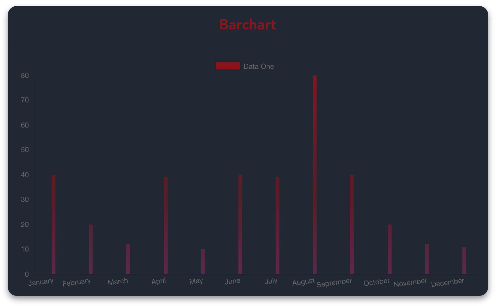
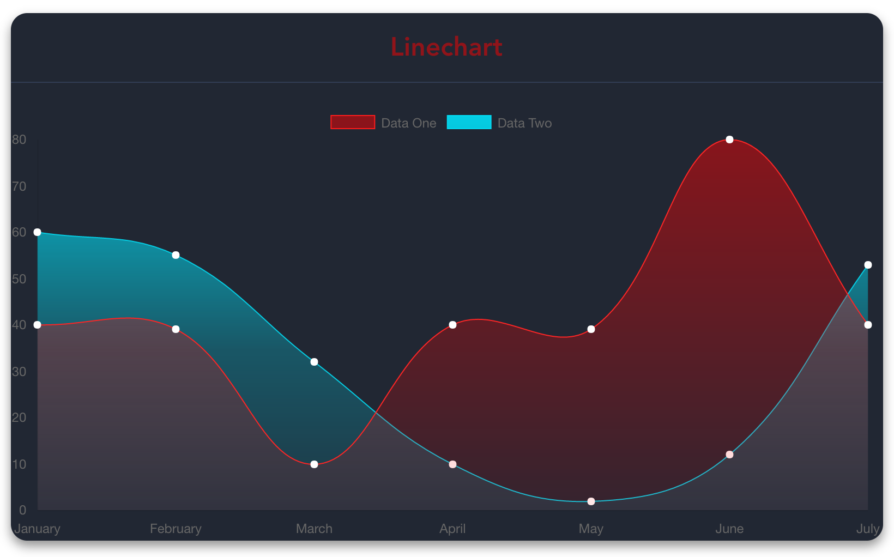
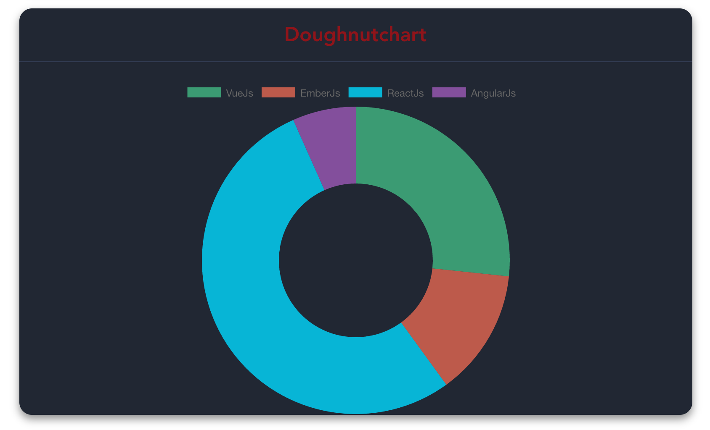
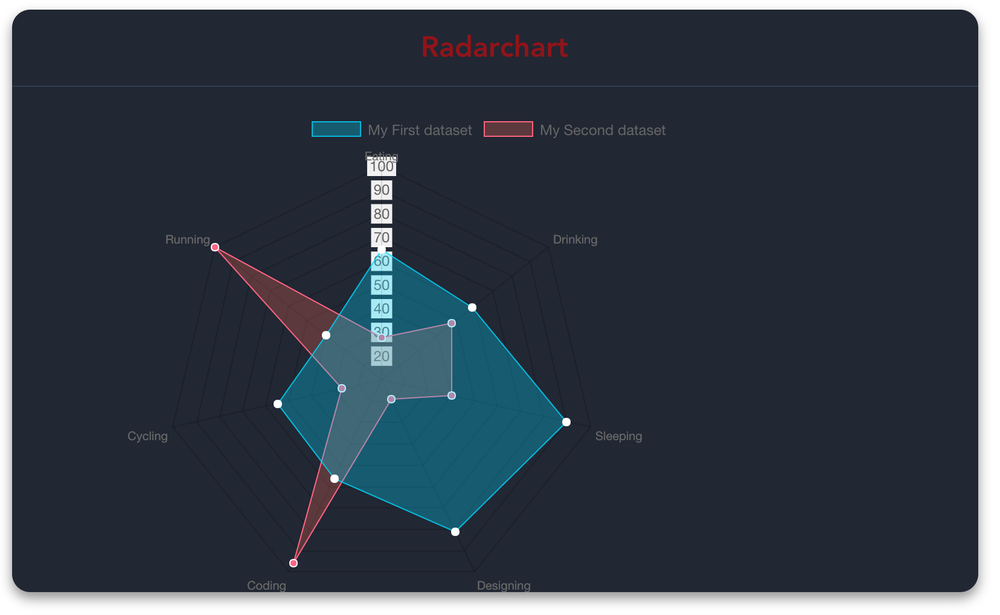
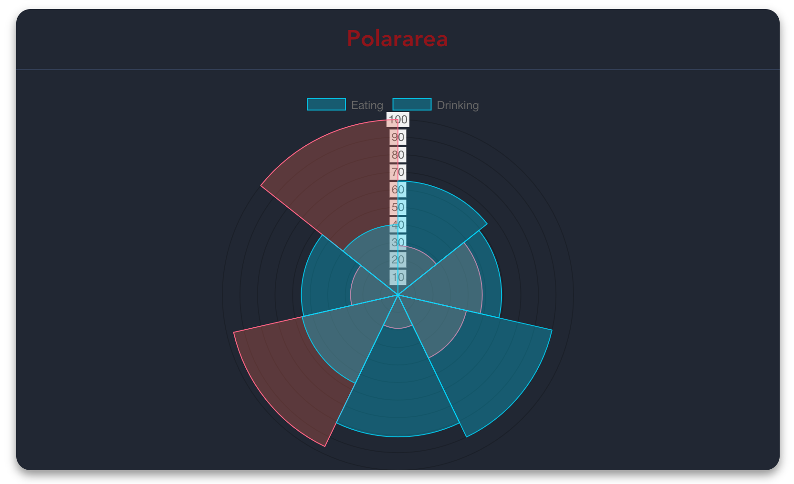
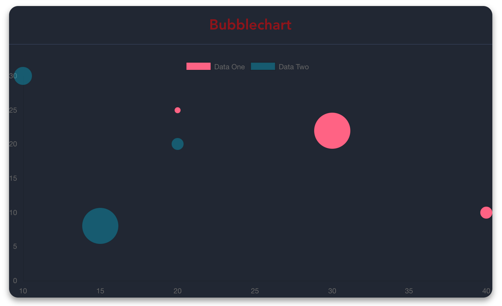

<div align="center">
  
</div>

[](https://badge.fury.io/js/vue-chartjs)
[](https://codecov.io/gh/apertureless/vue-chartjs)
[](https://travis-ci.org/apertureless/vue-chartjs)
[](http://packagequality.com/#?package=vue-chartjs)
[](https://www.npmjs.com/package/vue-chartjs)
[](https://gitter.im/vue-chartjs/Lobby)
[](https://github.com/apertureless/vue-chartjs/blob/master/LICENSE.txt)
[](https://cdnjs.com/libraries/vue-chartjs)

# vue-chartjs

**vue-chartjs** é um wrapper para o [Chart.js](https://github.com/chartjs/Chart.js) no vue. Você pode criar gráficos reutilizáveis facilmente.

## Demo & Docs

- 📺 [Demo](http://demo.vue-chartjs.org/)
- 📖 [Docs](http://www.vue-chartjs.org/)

### Compatibilidade

- v1 later `@legacy`
  - Vue.js 1.x
- v2 later
  - Vue.js 2.x

Após a release final do vue.js 2, você também instala por padrão o vue-chartjs v2 pelo npm.
Não é mas necessária a tag @next. Se você quiser a versão v1, você precisa definir a versão ou usar uma tag legada.
Se está procurando pela versão v1, dê uma olhada nessa [branch](https://github.com/apertureless/vue-chartjs/tree/release/1.1.3)

## Instalação

Simplemente execute `yarn add vue-chartjs chart.js`

Ou se quiser utilizar diretamente no browser, adicione

```html
<script src="https://unpkg.com/vue-chartjs@2.6.0/dist/vue-chartjs.full.min.js"></script>
```
em seus scripts. Veja [Codepen](https://codepen.io/apertureless/pen/vxWbqB?editors=1010)

## Explicação das diferentes builds

Existem três diferentes pontos de entrada (entry points). Isso depende da configuração de build que você possui. As dependências são empacotadas (bundled) ou requisitadas como peerDependency.

- Browser
- Browserify / Webpack 1
- Webpack 2


| Build | Chart.js | Vue.js |
|---|---|---|
| vue-chartjs.full.js | Bundled | Bundled |
| vue-chartjs.full.min.js |  Bundled | Bundled  |
| vue-chartjs.js | peerDependency | peerDependency  |
| vue-chartjs.min.js | peerDependency  | peerDependency  |
| es/index* |  peerDependency | peerDependency  |

### Browser
Você pode usar o `vue-chartjs` diretamente no seu browser sem qualquer configuração de build. Como em [codepen](https://codepen.io/apertureless/pen/vxWbqB?editors=1010). Nesse caso, use `vue-chartjs.full.min.js` que é a versão minificada. Esse arquivo contém o Vue.js e o Chart.js inseridos nele. E são  And empacotados (bundled) em um módulo UMD. Então você precisa somente desse arquivo.


### Browserify / Webpack 1

Se você estiver usando Gulb, Browserify ou Webpack 1 a opção é `vue-chartjs.js`, que é __transpiled__ e __bundled__ no modelo UMD.

Porém, Vue.js e Chart.js são `peerDependencies`, então você precisa instalá-los seperadamente. Na maioria dos projetos você terá o `Vue.js` instalado de qualquer maneira. Dessa forma, você pode ter diferentes versões do Vue.js e do Chart.j nesse pacote.


### Webpack 2
Se você está usando o Webpack 2, ele automaticamente usará a opção `jsnext:main` / `module`. Que é `es/index.js`, uma versão do código do es __transpiled__. Não é __bundled__ em módulo algum. Dessa forma, seu [tree shaking](https://webpack.js.org/guides/tree-shaking/) funcionará. Como na versão bundled, o `Vue.js` e o `Chart.js` são `peerDependencies` e precisam ser instalados.

## Como usar

Você precisa importar a classe de gráficos básica e extendê-la. Isso garante muito mais flexibilidade quando se está trabalhando com dados diferentes. Você pode passar dados via props ou vue-resource.

Você pode importar todo o pacote ou cada módulo individualmente.

```javascript
import VueCharts from 'vue-chartjs'
import { Bar, Line } from 'vue-chartjs'
```

Apenas crie seu próprio componente.

```javascript
// CommitChart.js
import { Bar } from 'vue-chartjs'

export default Bar.extend({
  mounted () {
    // Overwriting base render method with actual data.
    this.renderChart({
      labels: ['January', 'February', 'March', 'April', 'May', 'June', 'July', 'August', 'September', 'October', 'November', 'December'],
      datasets: [
        {
          label: 'GitHub Commits',
          backgroundColor: '#f87979',
          data: [40, 20, 12, 39, 10, 40, 39, 80, 40, 20, 12, 11]
        }
      ]
    })
  }
})
```

Então, simplesmente importe e use seu próprio componente extendido como um componente vue.

```javascript
import CommitChart from 'path/to/component/CommitChart'
```

## Another Example with options

Você pode sobreescrever as options (opções) padrão do gráfico. Basta passar o objeto options como segundo parâmetro do método de renderização.

```javascript
// MonthlyIncome.js
import { Line } from 'vue-chartjs'

export default Line.extend({
  props: ["data", "options"],
  mounted () {
    this.renderChart(this.data, this.options)
  }
})
```

Use isso no seu componente vue

```javascript
import MonthlyIncome from 'path/to/component/MonthlyIncome'

<template>
  <monthly-income :data={....} />
</template>

<script>
export default {
  components: { MonthlyIncome },
  ....
}
</script>
```

## Reactivity (Reatividade)

O Chart.js não atualiza nem re-renderiza o gráfico se novos dados são passados.
Porém, você pode implementar isso por si só ou usar um dos dois mixins inclusos.

- `reactiveProp`
- `reactiveData`

Ambos estão incluídos no módulo de `mixins`.

Os mixins criam automaticamente o `chartData` como um prop ou como um data. E adiciona um watcher. Se os dados mudarem, o gráfico será atualizado. Mas matenha em mente as limitações do vue e do javascript para as mutations(mutações) em vetores e objetos. Mais informações [aqui](http://vue-chartjs.org/#/home?id=reactive-data)


```javascript
// MonthlyIncome.js
import { Line, mixins } from 'vue-chartjs'

export default Line.extend({
  mixins: [mixins.reactiveProp],
  props: ["chartData", "options"],
  mounted () {
    this.renderChart(this.chartData, this.options)
  }
})

```

### Módulo de Mixins
O módulo de `mixins` está incluído no módulo do  `VueCharts` e como módulo separado.
Algumas maneiras de importá-los:

```javascript
// Load complete module with all charts
import VueCharts from 'vue-chartjs'

export default VueCharts.Line.extend({
  mixins: [VueCharts.mixins.reactiveProp],
  props: ["chartData", "options"],
  mounted () {
    this.renderChart(this.chartData, this.options)
  }
})
```

```javascript
// Load speperate modules
import { Line, mixins } from 'vue-chartjs'

export default Line.extend({
  mixins: [mixins.reactiveProp],
  props: ["chartData", "options"],
  mounted () {
    this.renderChart(this.chartData, this.options)
  }
})
```

```javascript
// Load speperate modules with destructure assign
import { Line, mixins } from 'vue-chartjs'
const { reactiveProp } = mixins

export default Line.extend({
  mixins: [reactiveProp],
  props: ["chartData", "options"],
  mounted () {
    this.renderChart(this.chartData, this.options)
  }
})
```

## Gráficos disponíveis

### Gráfico de Barra



### Gráfico de Linha



### Donut



### Pizza


### Radar



### Área Polar



### Bolha



## Configurações de Build

``` bash
# Instala as dependências
npm install

# roda o servidor com hot reload at localhost:8080
npm run dev

# build para produção com minificação
npm run build

# roda testes unitários
npm run unit

# roda testes e2e
npm run e2e

# roda todos os teste
npm test
```

Para informações detalhadas de como as coisas funcionam, confira o [guia](http://vuejs-templates.github.io/webpack/) e [documentação do vue-loader](http://vuejs.github.io/vue-loader).

## Contribuindo

1. Faça um fork o projeto ( https://github.com/apertureless/vue-chartjs/fork )
2. Crie uma branch da sua feature (`git checkout -b my-new-feature`)
3. Faça o commit das suas modificações (`git commit -am 'Add some feature'`)
4. Faça o push da branch (`git push origin my-new-feature`)
5. Crie uma nova requisição de pull

## License

Esse software é distribuído sob a licença [MIT license](LICENSE.txt).
