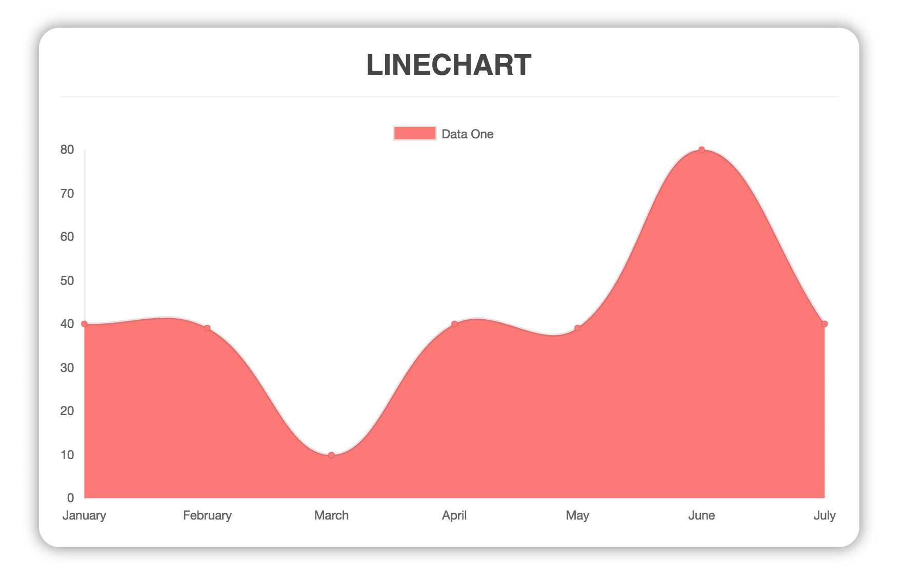
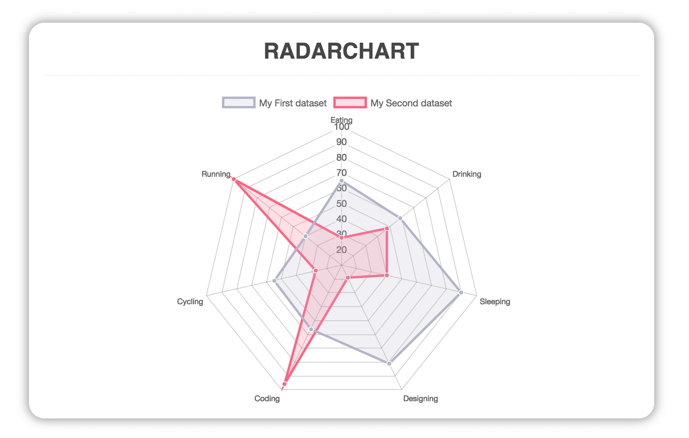
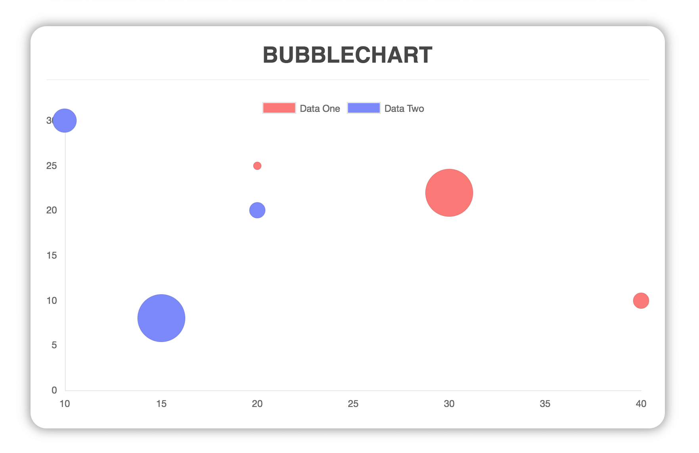

---
search:
- "language\:en"
---

# vue-chartjs
**vue-chartjs** is a wrapper for [Chart.js](https://github.com/chartjs/Chart.js) in Vue. You can easily create reusable chart components.

## Introduction
`vue-chartjs` lets you use Chart.js without much hassle inside Vue. It's perfect for people who need simple charts up and running as fast as possible.

It abstracts the basic logic but exposes the Chart.js object to give you maximal flexibility.

## Installation
If you are working with Vue.js 2+ simple run:

`yarn add vue-chartjs chart.js`

If you are using vue 1.x please use the `legacy` tag. However the Vue 1 version is not maintained anymore.

`yarn add vue-chartjs@legacy`


## Legend Generation

`vue-chartjs` provides a small helper to generate a HTML legend.

```js
import { Line } from 'vue-chartjs'

export default {
  extends: Line,
  props: ['datasets', 'options']
  data: () => ({
    htmlLegend: null
  })
  mounted () {
    this.renderChart(this.datasets, this.options)
    this.htmlLegend = this.generateLegend()
  }
}
```

## Examples

## Reactive Data

Chart.js does not provide a live update if you change the datasets. However `vue-chartjs` provides two mixins to achieve this.

- `reactiveProp`
- `reactiveData`

Both mixins do actually achieve the same. Most of the time you will use `reactiveProp`. It extends the logic of your chart component and automatically creates a prop named `chartData` and adds a `vue watch` on this prop. On data change, it will either call `update()` if only the data inside the datasets has changed or `renderChart()` if new datasets were added.

`reactiveData` simply creates a local chartData variable which is not a prop! and adds a watcher. This is only useful, if you need single purpose charts and make an API call inside your chart component.

```javascript
data () {
  return {
    chartData: null
  }
}
```

### Events

The reactive mixins will emit events if the data changes. You can listen to them with `v:on` on the chart component. Following events are available:

- `chart:render` - if the mixin performs a complete rerender
- `chart:destroy` - if the mixin deletes the chart object instance
- `chart:update` - if the mixin performs an update instead of a re-render
- `labels:update` - if new labels were set
- `xlabels:update` if new xLabels were set
- `ylabels:update` - if new yLabels were set

### Example

**LineChart.js**
```javascript
import { Line, mixins } from 'vue-chartjs'
const { reactiveProp } = mixins

export default {
  extends: Line,
  mixins: [reactiveProp],
  props: ['options'],
  mounted () {
    // this.chartData is created in the mixin.
    // If you want to pass options please create a local options object
    this.renderChart(this.chartData, this.options)
  }
}
```

**RandomChart.vue**

```javascript
<template>
  <div class="small">
    <line-chart :chart-data="datacollection"></line-chart>
    <button @click="fillData()">Randomize</button>
  </div>
</template>

<script>
  import LineChart from './LineChart.js'

  export default {
    components: {
      LineChart
    },
    data () {
      return {
        datacollection: null
      }
    },
    mounted () {
      this.fillData()
    },
    methods: {
      fillData () {
        this.datacollection = {
          labels: [this.getRandomInt(), this.getRandomInt()],
          datasets: [
            {
              label: 'Data One',
              backgroundColor: '#f87979',
              data: [this.getRandomInt(), this.getRandomInt()]
            }, {
              label: 'Data One',
              backgroundColor: '#f87979',
              data: [this.getRandomInt(), this.getRandomInt()]
            }
          ]
        }
      },
      getRandomInt () {
        return Math.floor(Math.random() * (50 - 5 + 1)) + 5
      }
    }
  }
</script>

<style>
  .small {
    max-width: 600px;
    margin:  150px auto;
  }
</style>
```

<p class="warning">
  ⚠ Attention: If you mutate your data in a parent component and pass it to your child chart component keep the javascript limitations in mind.
  More info in this [issue#44](https://github.com/apertureless/vue-chartjs/issues/44)
</p>

### Limitations
  <ul>
    <li></li>
    <li></li>
    <li></li>
  </ul>

## Chart.js object

Sometimes you need more control over Chart.js. That's why you can access the Chart.js instance over `this.$data._chart`.

## Inline plugins

In Chart.js you can define global and inline plugins. Global plugins are working without problems with `vue-chartjs` like in the [Chart.js docs](http://www.chartjs.org/docs/latest/developers/plugins.html) described.

If you want to add inline plugins, `vue-chartjs` exposes a helper method called `addPlugin()`
You should call `addPlugin()` before the `renderChart()` method.

### Example

```javascript
mounted () {
  this.addPlugin({
    id: 'my-plugin',
    beforeInit: function (chart) {
      ....
    }
  })
}
```
## Custom / New Charts

Sometimes you need to extend the default Chart.js charts. There are a lot of examples how to extend and modify the default charts. Or you want to create a own chart type.

In `vue-chartjs` you can do this pretty much the same way.

```js
// 1. Import Chart.js so you can use the global Chart object
import Chart from 'chart.js'
// 2. Import the `generateChart()` method to create the vue component.
import { generateChart } from 'vue-chartjs'

// 3. Extend on of the default charts
// http://www.chartjs.org/docs/latest/developers/charts.html
Chart.defaults.LineWithLine = Chart.defaults.line;
Chart.controllers.LineWithLine = Chart.controllers.line.extend({ /* custom magic here */})

// 4. Generate the vue-chartjs component
// First argument is the chart-id, second the chart type.
const CustomLine = generateChart('custom-line', 'LineWithLine')

// 5. Extend the CustomLine Component just like you do with the default vue-chartjs charts.

export default {
  extends: CustomLine,
  mounted () {
    // ....
  }
}
```

## Available Charts

### Bar Chart
<p class="tip">
  There are two versions of the Bar chart: `{Bar}` and `{HorizontalBar}`
</p>


### Line Chart



### Doughnut


### Pie


### Radar



### Polar Area


### Bubble



### Scatter

This chart has a different data structure then the others. Right now the reactive mixins are not working for this chart type.


## Resources

You can find here some resources like tutorials on how to use `vue-chartjs`

- [Using vue-chartjs with WordPress](https://medium.com/@apertureless/wordpress-vue-and-chart-js-6b61493e289f)
- [Create stunning Charts with Vue and Chart.js](https://hackernoon.com/creating-stunning-charts-with-vue-js-and-chart-js-28af584adc0a)
- [Let’s Build a Web App with Vue, Chart.js and an API Part I](https://hackernoon.com/lets-build-a-web-app-with-vue-chart-js-and-an-api-544eb81c4b44)
- [Let’s Build a Web App with Vue, Chart.js and an API Part II](https://hackernoon.com/lets-build-a-web-app-with-vue-chart-js-and-an-api-part-ii-39781b1d5acf)
- [Build a realtime chart with VueJS and Pusher](https://blog.pusher.com/build-realtime-chart-with-vuejs-pusher/)
